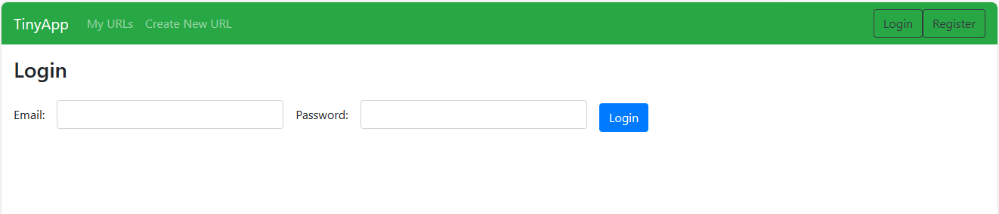

# TinyApp Project

Do you tire of typing out very long boring websites into your browser? Well then look no further! TinyApp is a full stack web application built with Node and Express that allows users to shorten long URLs (à la bit.ly). Change them to whatever you like! 

## Final Product

## Dependencies

- Node.js
- Express
- EJS
- bcryptjs
- cookie-session

## Getting Started

- Install all dependencies (using the `npm install` command).
- Run the development web server using the `node express_server.js` command.

## Usage

Register an account, and then create your URLS. You can add any and all the URLS you can think of, and edit them as much as you'd like!

## Acknowledgments

Thanks Lighthouse Labs! 
And my mom.